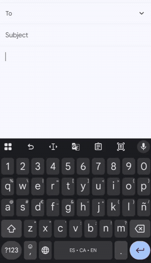
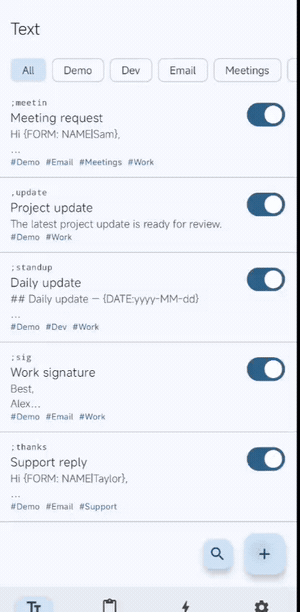
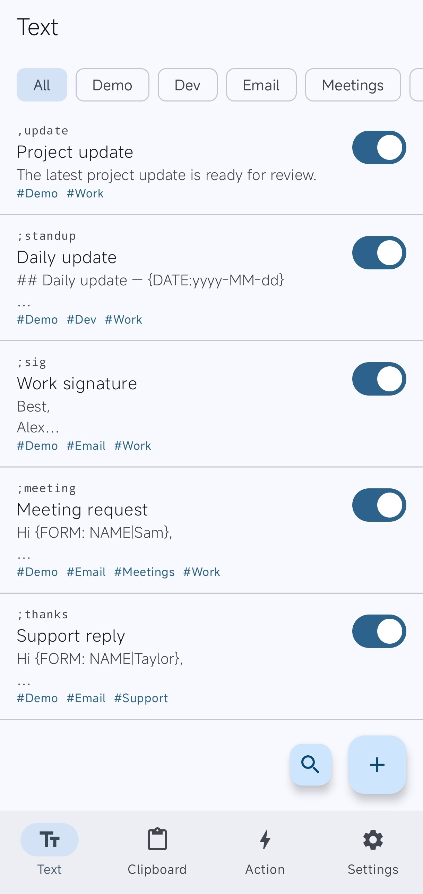
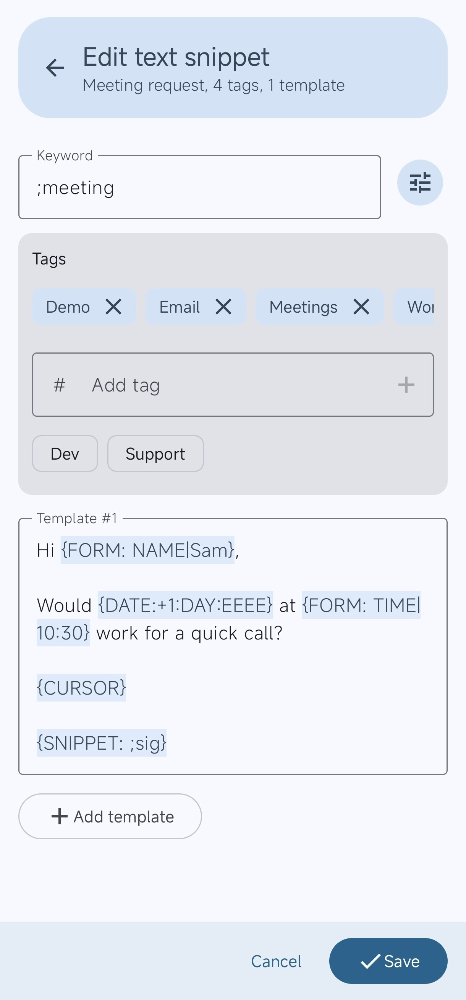
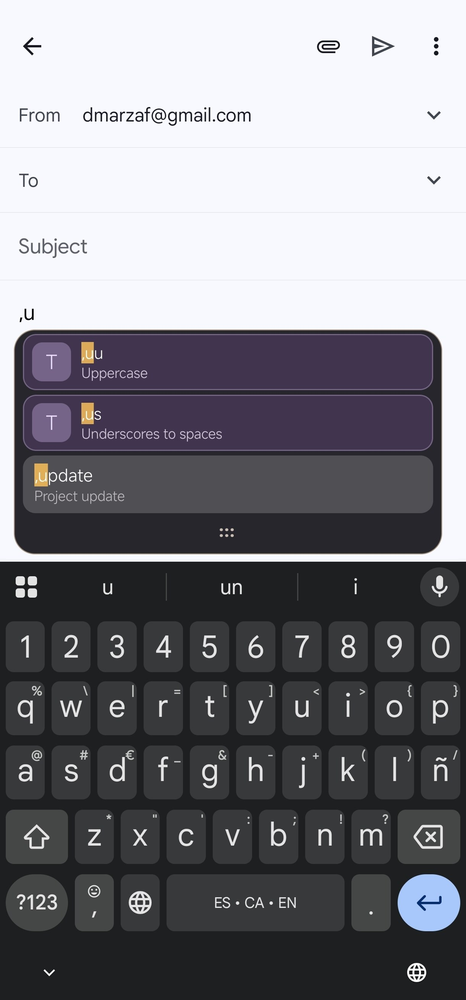
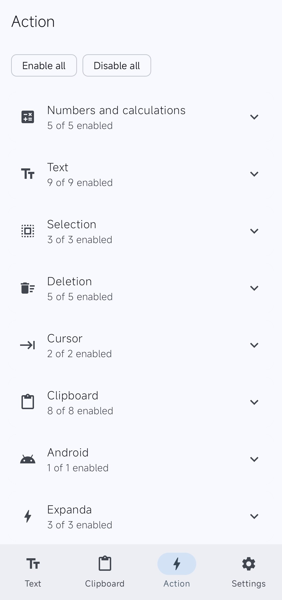
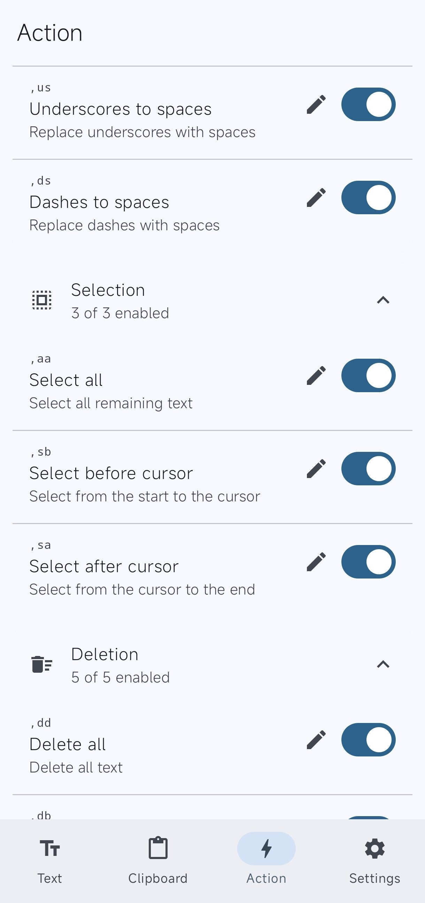
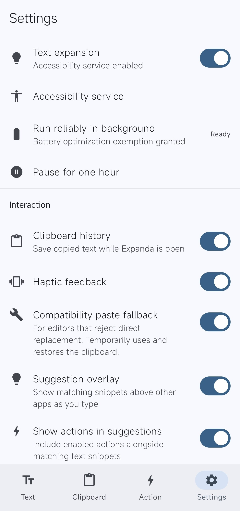
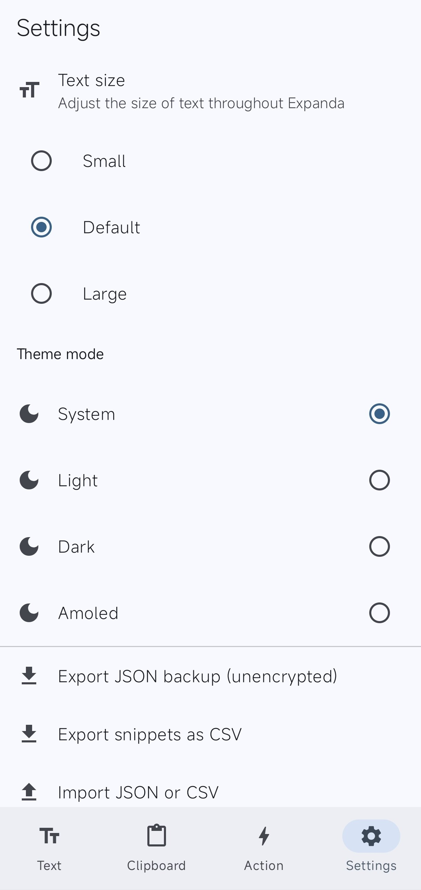

<div align="center">
  
  <h1>Expanda</h1>
  <p><strong>Type a shortcut. Insert anything.</strong><br>A free, offline, text expander for Android that works across your apps.</p>

  <p>
    <a href="https://github.com/diegomarzaa/expanda/releases/latest"></a>
    <a href="https://apps.obtainium.imranr.dev/redirect?r=obtainium%3A%2F%2Fapp%2F%7B%22id%22%3A%22dev.diego.expanda%22%2C%22url%22%3A%2F%2Fgithub.com%2Fdiegomarzaa%2Fexpanda%22%2C%22author%22%3A%22diegomarzaa%22%2C%22name%22%3A%22Expanda%22%7D"></a>
    <a href="LICENSE"></a>
    
    
    
  </p>
</div>

Expanda saves you from typing the same things over and over. 

Your email when someone asks for it. Your address for a delivery. Your IBAN when a friend owes you money. The WiFi password every time someone visits. Your phone number...

Expanda lets you save all of that behind a short shortcut. Type the shortcut anywhere: WhatsApp, Gmail, Chrome, Notes, a bank app, and it gets replaced instantly.

| You type | Expanda writes |
|---|---|
| `/mail` | `diego@example.com` |
| `/phone` | `+34 612 345 678` |
| `/addr` | `Calle Mayor 12, 3B, 28013 Madrid` |
| `/iban` | `ES91 2100 0418 4502 0005 1332` |
| `/wifi` | `WiFi: MiCasa · Password: welcome2024` |
| `/sorry` | `A random polite decline from a list of 3–4 you wrote` |
| `/today` | `Friday, 29 August 2026` |
| `/sig` | `Best regards, + your name + phone` |
| `/late15` (or `/late45`, etc.) | `Sorry, running 15 min late! 🙏` |

Set them up once. Save yourself thousands of taps.

> [!WARNING] 
> Expanda was built quickly for personal use with a lot of AI help. I'm not an Android developer, so the code has limited human review and bugs may remain. I'm sharing it in case others find it useful; reports and PRs welcome.

## See it in action

<table>
  <tr>
    <td align="center"><br><strong>Use snippets anywhere</strong></td>
    <td align="center"><br><strong>Create a snippet</strong></td>
  </tr>
</table>

<details>
<summary><strong>More screenshots</strong></summary>

<table>
  <tr>
    <td align="center"><br><strong>Snippets</strong></td>
    <td align="center"><br><strong>Template editor</strong></td>
    <td align="center"><br><strong>Suggestions</strong></td>
  </tr>
  <tr>
    <td align="center"><br><strong>Actions</strong></td>
    <td align="center"><br><strong>Action settings</strong></td>
    <td align="center"><br><strong>Settings</strong></td>
  </tr>
  <tr>
    <td align="center" colspan="3"><br><strong>Appearance</strong></td>
  </tr>
</table>

</details>

## Get started

1. Install the APK from [GitHub Releases](https://github.com/diegomarzaa/expanda/releases/latest) (Android 8.0+).
2. Open Expanda — it'll walk you through enabling the Accessibility service.
3. Create your first snippet and try it in WhatsApp.

> **Android 13+ sideload heads-up:** if Android blocks Accessibility, open **App info → ⋮ → Allow restricted settings**. Expanda tells you this in-app too.

## Features

**Everyday use**
- Works in any editable field, across all your apps
- Suggestion popup as you type, with a preview of what will be inserted
- Backspace right after an expansion to undo it
- Quick Settings tile to pause/resume Expanda without opening the app

**Smart snippets**
- Forms, today's date, clipboard content, random picks and nested snippets — with control over where the cursor lands
- Regex triggers with named captures (e.g. `,late15` extracts `15`)
- Playground to test snippets safely without touching your real library

**Sync, backup & sharing**
- Espanso-compatible YAML — share a `match/` folder with your desktop setup, edits go both ways
- Full app backup, plus YAML and CSV import/export

**Control & polish**
- Per-app exclusions (skip banking apps, password managers, whatever you want)
- Tags, search and bulk edit for large libraries
- Light, dark and AMOLED themes; text scaling; optional haptic feedback

## Permissions and privacy

Expanda uses only these Android permissions and protected capabilities:

| Permission | Purpose |
|---|---|
| Accessibility service | Reads changes in active editable fields and replaces matching shortcuts. Password fields are ignored. |
| Battery optimization exemption request | Opens Android's battery settings so you can allow reliable background operation. |
| Vibration | Provides optional haptic feedback after an expansion. |

The Accessibility service is a special service capability rather than a regular manifest permission. Expanda does **not** declare `INTERNET`, so the app cannot send snippets, typed text, clipboard history or usage statistics over the network through Android's standard networking APIs.

The clipboard history and local usage statistics are enabled by default and can be disabled in Settings. See [Privacy](PRIVACY.md) for stored data and deletion instructions, and [Permissions](PERMISSIONS.md) for the complete permission rationale.

## Compatibility and limitations

Android apps, keyboards and manufacturer customizations expose editable fields in different ways. Direct replacement can fail in some editors; the optional compatibility fallback temporarily uses and restores the clipboard for those cases.

Some manufacturers stop accessibility services during background use. Expanda can open the relevant Android battery settings, but the exact option name depends on the device.

Please use the [bug report template](https://github.com/diegomarzaa/expanda/issues/new?template=bug-report.yml) for compatibility problems. Include the Android version, device, keyboard, target app and exact steps without attaching private text.

## Build from source

You need JDK 17 and the Android SDK with API 36 installed.

```bash
git clone https://github.com/diegomarzaa/expanda.git
cd expanda
export JAVA_HOME=/path/to/jdk-17
export ANDROID_HOME=/path/to/android-sdk
./gradlew :app:assembleDebug
```

Run the local checks with:

```bash
./gradlew :app:testDebugUnitTest
./gradlew :app:lintDebug
```

Release signing uses a local, ignored `signing.properties` file. The repository contains no signing keys. See [BUILDING.md](BUILDING.md) for the full setup and release-signing format.

## Project status

Current release: **0.3.0**. It rebuilds Expanda around Espanso-compatible YAML, a new match model, tutorial onboarding, a Playground, a Source tab, and full local backups. Upgrading from 0.2.0 migrates your snippets automatically; syntax changes are documented in [CHANGELOG.md](CHANGELOG.md).

See [CHANGELOG.md](CHANGELOG.md) for release history and [SECURITY.md](SECURITY.md) for private vulnerability reports.

## Motivation and credits

I started Expanda because I could not find an open-source Android text expander that covered the workflow I wanted. The project also became a way to learn about accessibility services, background execution, overlays and Android text editing.

[Typing Hero](https://typinghero.app/) provided the main product and workflow reference. [Expandroid](https://github.com/lochidev/Expandroid) also influenced the project. Expanda is an independent implementation and is not affiliated with either project.

## Contributing

Bug reports, documentation improvements and pull requests are welcome. Read [CONTRIBUTING.md](CONTRIBUTING.md) before opening a change.

## License

Expanda 0.3.0 and later are free software under [GNU GPLv3](LICENSE). If you distribute a modified build, you must provide its corresponding source under the same license. The published 0.2.0 release remains available under MIT because changing the license cannot revoke permissions already granted for that version.
